# PayAudit

**A Central Bank Digital Currency with Offline Payment and Post-Hoc Auditability**

[](https://go.dev/)
[](https://github.com/Consensys/gnark)
[](https://github.com/Consensys/gnark-crypto)

Go prototype of an **account-based** CBDC with cash-like offline payments and lawful post-hoc audit, in pure cryptography (no TEE). Everyday verification is split from exceptional audit: the Central Bank sees no private data; any 3 of 5 maintainers can open a transaction only under a lawful order.

Built with [`gnark`](https://github.com/Consensys/gnark) (Groth16) and [`gnark-crypto`](https://github.com/Consensys/gnark-crypto) (BN254 / twisted Edwards). Circuit style follows the [gnark Groth16 examples](https://github.com/Consensys/gnark/tree/master/examples). Spec: [docs/protocol.pdf](docs/protocol.pdf).

<p align="center">
  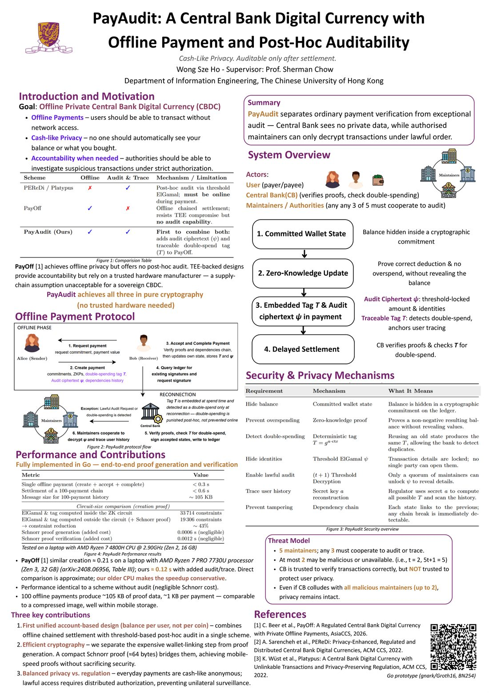
</p>

## What this repo implements

| Spec | Code |
| --- | --- |
| Setup, `pkThEnc` | `CompileCircuits`, `Setup.PkTh` |
| Enrollment `π_enroll`, `scm0` | `CircuitEnroll`, `NewState` |
| RequestPayment `rcm` | `PaymentRequest` |
| CreatePayment | `CreatePayment` / `CreatePaymentInline` |
| CompletePayment | `AcceptPayment`, `CompletePayment` |
| `π_state^create`, `π_pm`, `π_link`, `π_dep^create` | `CircuitStateCreate`, `CircuitPm`, `ProvePaymentLink`, `CircuitDepCreate` |
| `π_state^complete`, `π_dep^complete` | `CircuitStateComplete`, `CircuitDepComplete` |
| `T_S`, `ψ_S` | `TracingTag`, `ElGamalEncrypt` |

Not included: KYC directory, networked ledger, maintainer threshold-decryption service, or the reconnect/audit/trace control loops as a deployed system.

## Construction

<p align="center">
  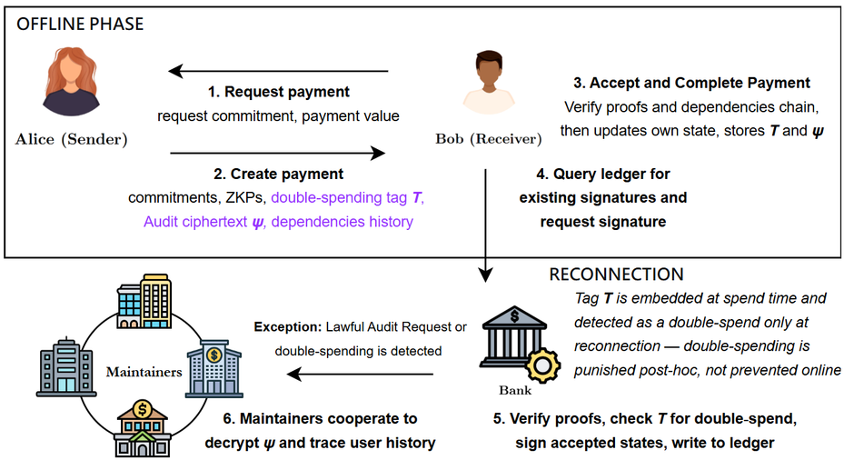
</p>

Commitment `Comm` is MiMC-BN254 (`nativeCommit`). `D = 5t+1`, prototype `t = 2` so `D = 5`. Epoch slack `Δ_sync = 5` (`SyncTol`).

### 1. Setup

`CompileCircuits`

<p align="center">
  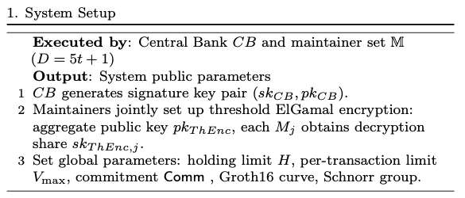
</p>

### 2. Enrollment

`CircuitEnroll`, `NewState`

<p align="center">
  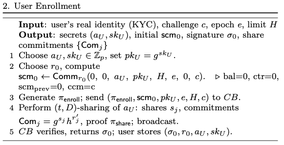
</p>

### 3. Offline spend

#### 3.1 RequestPayment

`PaymentRequest`

<p align="center">
  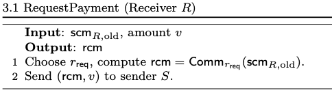
</p>

#### 3.2 CreatePayment

`CreatePayment`

<p align="center">
  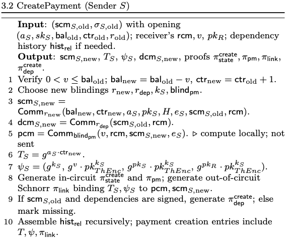
</p>

In-circuit: `π_state^create`, `π_pm`. Out-of-circuit Schnorr `π_link` binds `T_S`, `ψ_S` to `pcm`, `scm_S,new`. Optional `π_dep^create` if the old state is signed.

#### 3.3 CompletePayment

`AcceptPayment` then `CompletePayment`

<p align="center">
  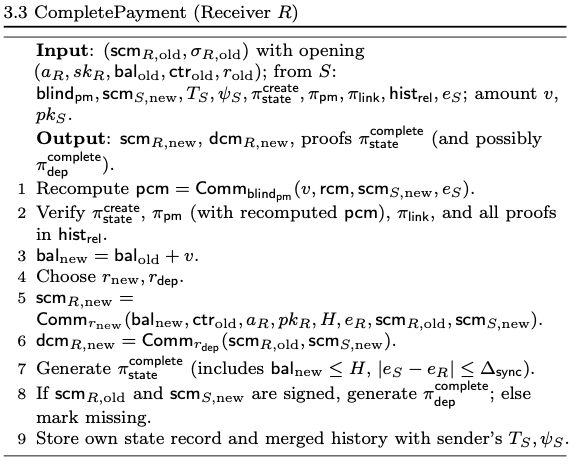
</p>

### Proof relations

<p align="center">
  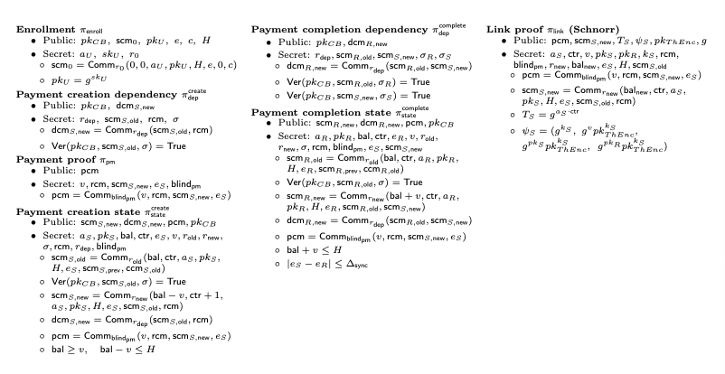
</p>

| Proof | Circuit / function |
| --- | --- |
| `π_enroll` | `CircuitEnroll` |
| `π_dep^create` | `CircuitDepCreate` |
| `π_pm` | `CircuitPm` |
| `π_state^create` | `CircuitStateCreate` |
| `π_dep^complete` | `CircuitDepComplete` |
| `π_state^complete` | `CircuitStateComplete` |
| `π_link` (Schnorr) | `ProvePaymentLink` / `VerifyPaymentLink` |

`CreatePaymentInline` / `CircuitStateCreateInline` move `T_S`, `ψ_S` into the Groth16 circuit (larger; used as the baseline in the circuit-size table).

### 4. Reconnect and settle

<p align="center">
  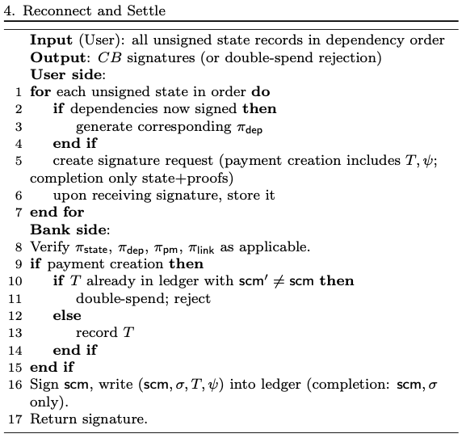
</p>

### 5–6. Audit and trace

<p align="center">
  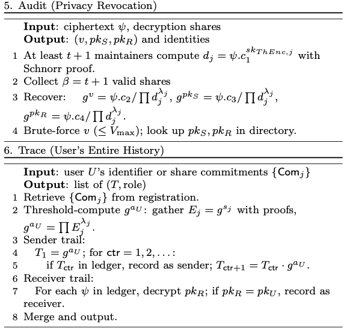
</p>

## Actors

<p align="center">
  
  &nbsp;
  
  &nbsp;
  
  &nbsp;
  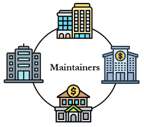
</p>

| Actor | Role |
| --- | --- |
| **Users** (payer / payee) | Hold a committed wallet; pay offline |
| **Central Bank (CB)** | Verifies proofs and checks double-spending. Trusted to verify correctly, **not** trusted to protect privacy |
| **Maintainers** | Any 3 of 5 must cooperate to audit or trace |

## Comparison

<p align="center">
  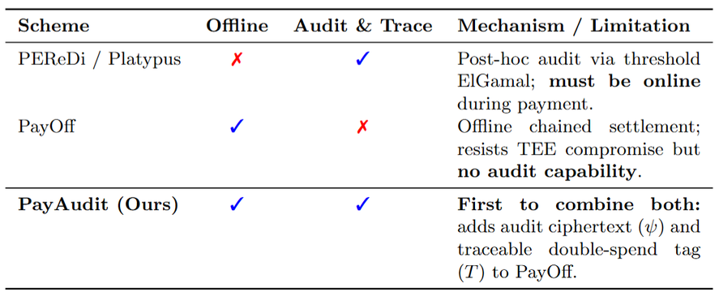
</p>

| Scheme | Offline | Audit &amp; Trace | Mechanism / limitation |
| --- | --- | --- | --- |
| [PEReDi](https://dl.acm.org/doi/10.1145/3548606.3560657) / [Platypus](https://eprint.iacr.org/2021/1443) | ✗ | ✓ | Threshold ElGamal audit; **must be online** during payment |
| [PayOff](https://arxiv.org/abs/2408.06956) | ✓ | ✗ | Offline chained settlement; **no audit** |
| **PayAudit** | ✓ | ✓ | Audit ciphertext `ψ` and traceable tag `T` |

A related public CBDC prototype (online, Circom/snarkjs) is [`applied-crypto/cbdc`](https://github.com/applied-crypto/cbdc).

## Security

<p align="center">
  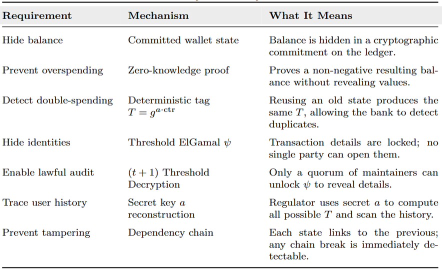
</p>

| Requirement | Mechanism | Meaning |
| --- | --- | --- |
| Hide balance | Committed wallet state | Balance sits in a commitment on the ledger |
| Prevent overspending | Zero-knowledge proof | Prove a valid resulting balance without revealing values |
| Detect double-spending | Deterministic tag `T = g^{a · ctr}` | Reusing an old state yields the same `T` |
| Hide identities | Threshold ElGamal `ψ` | Amount and identities are locked; no single party can open them |
| Enable lawful audit | `(t+1)`-threshold decryption | Only a quorum of maintainers unlocks `ψ` |
| Trace user history | Secret `a` reconstruction | Regulator computes candidate `T` values and scans the ledger |
| Prevent tampering | Dependency chain | Each state links to the previous; a break is detectable |

**Threat model.** 5 maintainers; any 3 must cooperate to audit or trace. At most 2 may be malicious or unavailable (`t = 2`, `D = 5t+1 = 5`). Even if CB colludes with all malicious maintainers (up to 2), privacy remains intact.

## Performance

Laptop: AMD Ryzen 7 4800H @ 2.90 GHz (Zen 2, 16 GB). Stack: [`gnark`](https://github.com/Consensys/gnark) / Groth16 / BN254.

<p align="center">
  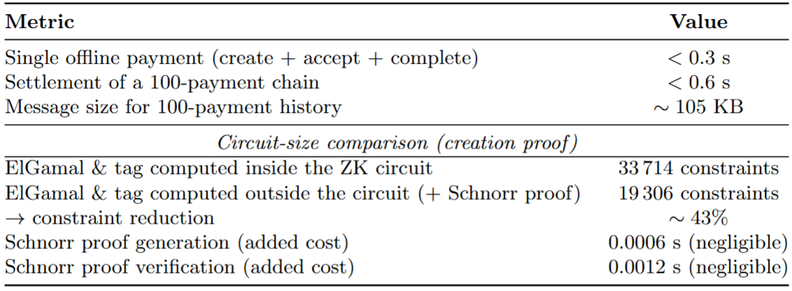
</p>

| Metric | Result |
| --- | --- |
| Single offline payment (create + accept + complete) | &lt; 0.3 s |
| Settlement of a 100-payment chain | &lt; 0.6 s |
| Message size for 100-payment history | ~105 KB (~1 KB per payment) |

| Circuit-size comparison (creation proof) | Constraints / cost |
| --- | --- |
| ElGamal &amp; tag **inside** the ZK circuit | 33,714 |
| ElGamal &amp; tag **outside** + Schnorr proof | 19,306 |
| Constraint reduction | ~43% |
| Schnorr generation / verification | 0.0006 s / 0.0012 s (negligible) |

PayOff similar creation ≈ 0.21 s on a Ryzen 7 PRO 7730U ([arXiv:2408.06956](https://arxiv.org/abs/2408.06956), Table III); ours ≈ 0.12 s with added audit/trace.

## Build

Requires [Go 1.24+](https://go.dev/dl/).

```bash
git clone https://github.com/eddiewsh/PayAudit
cd PayAudit
go test ./...
```

```bash
go test ./... -run TestPrintCircuitTable -count=1
go test ./... -run TestPrintEndToEndTable -count=1
```

Table tests are skipped under `-short`.

## Layout

| File | |
| --- | --- |
| `payaudit.go` | Circuits and create / accept / complete |
| `crypto.go` | MiMC, threshold ElGamal, tracing tag, Schnorr `π_link` |
| `payaudit_bench_test.go` | Circuit table and end-to-end latency |
| `docs/protocol.pdf` | Protocol / proof relations |
| `docs/PayAudit-poster.pdf` | Poster |
| `docs/figures/steps/` | Setup, enroll, spend, settle, audit, proofs |

## Related repositories

- [`Consensys/gnark`](https://github.com/Consensys/gnark)
- [`Consensys/gnark-crypto`](https://github.com/Consensys/gnark-crypto)
- [`applied-crypto/cbdc`](https://github.com/applied-crypto/cbdc)
- [`matter-labs/awesome-zero-knowledge-proofs`](https://github.com/matter-labs/awesome-zero-knowledge-proofs)

## References

1. C. Beer et al., *PayOff: A Regulated Central Bank Digital Currency with Private Offline Payments*, AsiaCCS, 2026. [arXiv:2408.06956](https://arxiv.org/abs/2408.06956)
2. A. Sarencheh et al., *PEReDi: Privacy-Enhanced, Regulated and Distributed Central Bank Digital Currencies*, ACM CCS, 2022.
3. K. Wüst et al., *Platypus: A Central Bank Digital Currency with Unlinkable Transactions and Privacy-Preserving Regulation*, ACM CCS, 2022. [ePrint 2021/1443](https://eprint.iacr.org/2021/1443)
4. G. Botrel et al., *gnark*, [github.com/Consensys/gnark](https://github.com/Consensys/gnark).
